# Control de citas para veterinaria

Este fue un proyecto realaizado en la universidad SENA de Colombia.

Se levantaron los requerimientos de un cliente real para desarrollar una aplicación web que permitiera llevar el control de las citas en su veterinaria.

## La aplicación consta de cuatro módulos

### Veterinarios: 
Este módulo administra el personal de la veterinaria que interactua con la aplicación desde veterinarios, auxiliares hasta admninistradores con sus respectivos permisos.

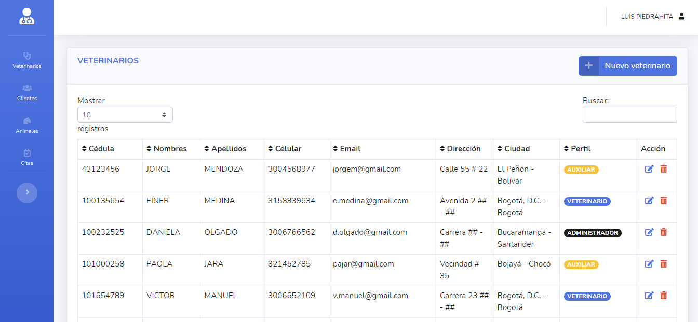

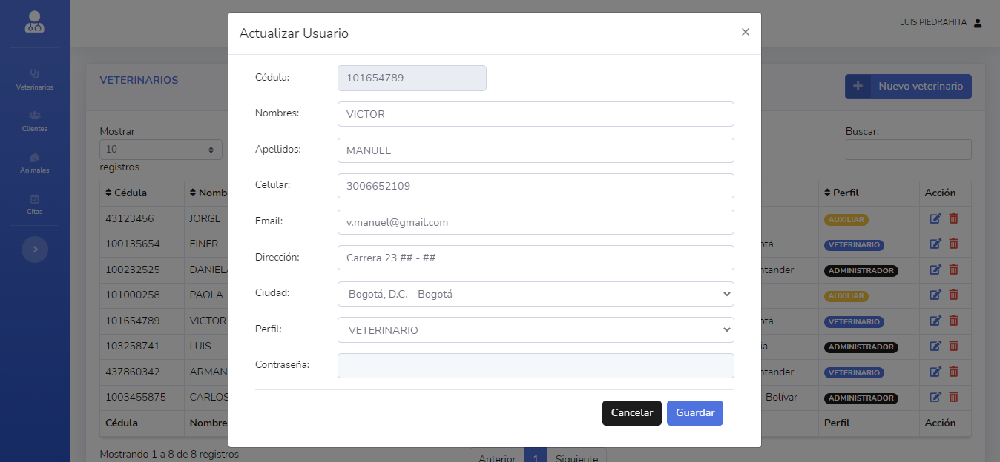

### Clientes:
Crud para los clientes que son los dueños de las mascotas o animales.

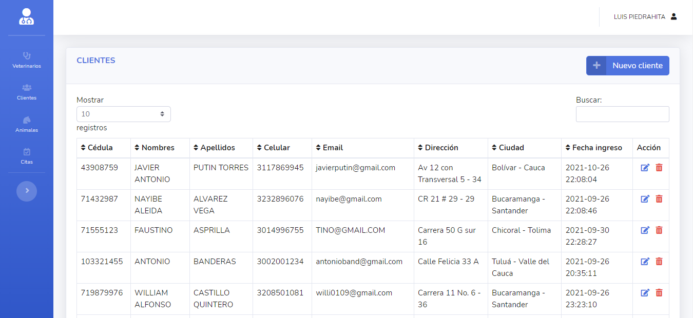

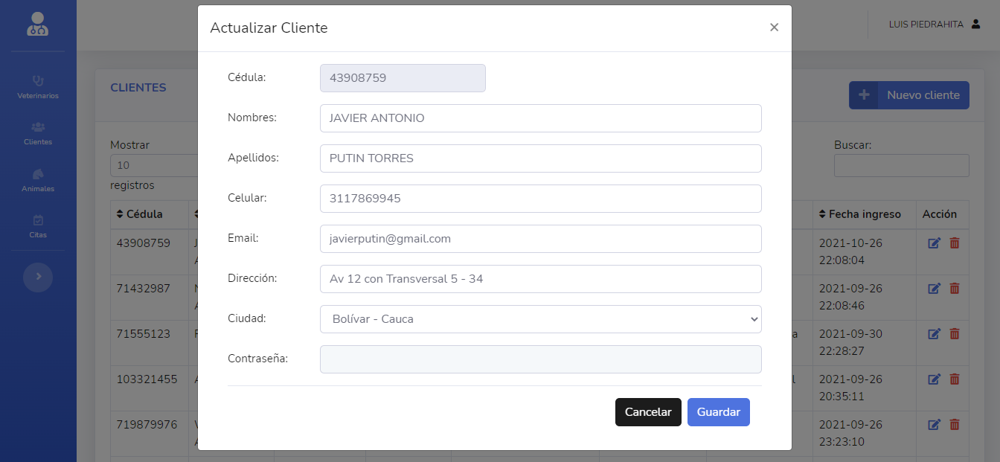

### Animales:
Crud para las mascotas ó animales; un cliente es el dueño de una ó varias mascotas, uno o varios animales como caballos ó vacas.

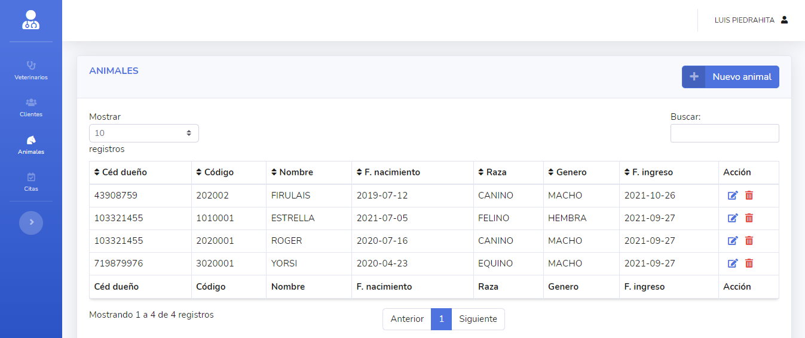

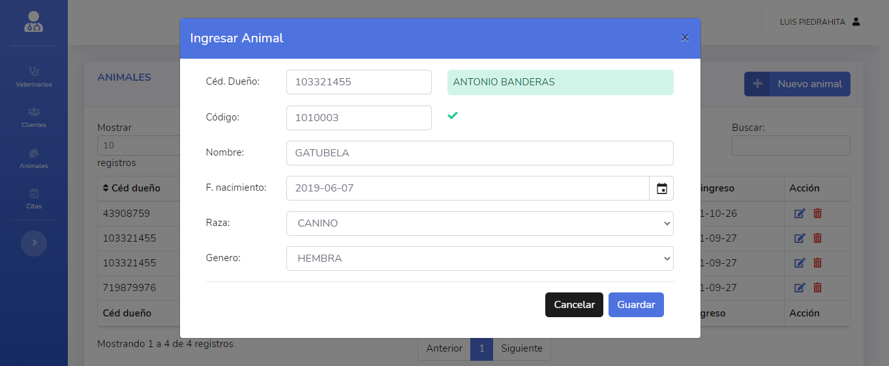

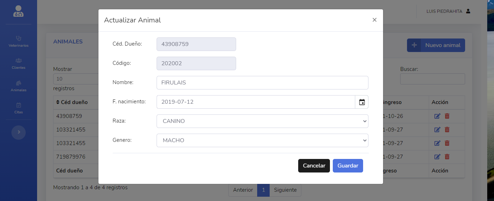

### Citas:
Aquí se lleva el control de las citas de cada animal.

Contiene el formulario para la asignación de citas, la lista de las citas con su respectivo estado y los botones de acción para cambiar el estado de cada cita

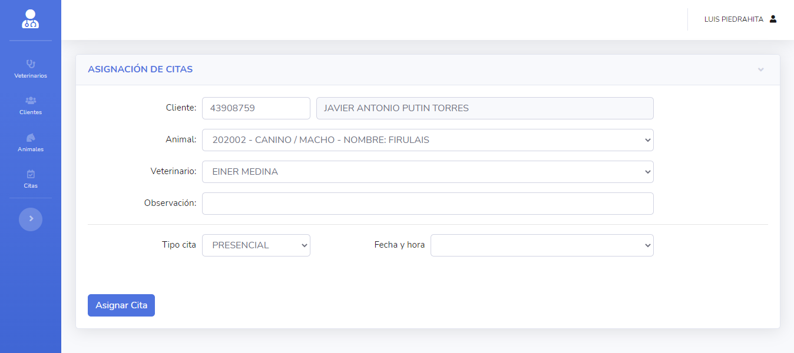

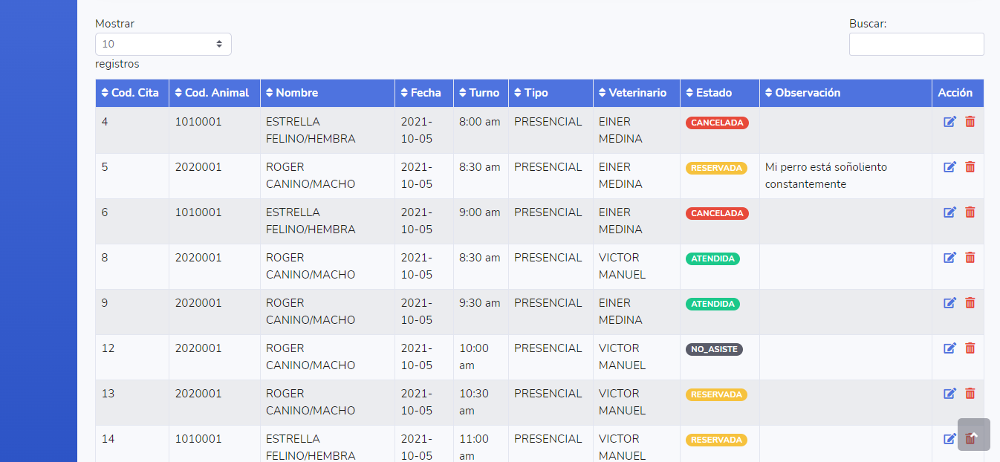

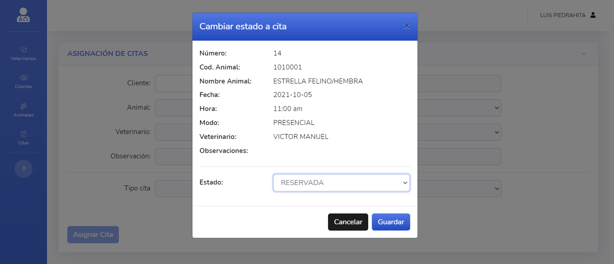

Home page

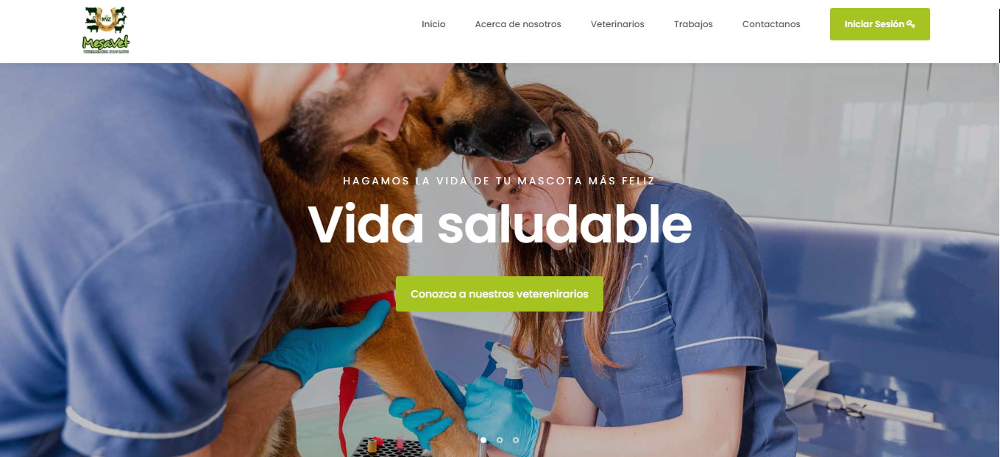

## Tecnologías utilizadas
- PHP
- Mysql
- Javascript
- Bootstrap
- HTML y CSS
